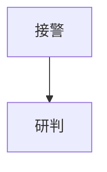

# Markdown Bid to DOCX

Use this skill to turn large Markdown bid manuscripts into polished Word documents. It is a production workflow, not a one-shot converter: preflight the Markdown, render Mermaid diagrams, normalize the manuscript, build DOCX, polish Word layout, then verify the output.

## Output Naming Rules

- Name the final DOCX after the source Markdown filename by default.
- If the input is `某项目技术标书.md`, the first final deliverable should be `某项目技术标书.docx`.
- If the same manuscript is revised again, keep the same base name and append a version suffix starting at `V2`, for example `某项目技术标书 V2.docx`, `某项目技术标书 V3.docx`.
- Apply the same base-name rule to draft DOCX artifacts where practical, for example `某项目技术标书-draft.docx`.
- Do not default to generic deliverable names such as `final.docx` when the source filename is available.

## Toolchain Contract

- Prefer the bundled scripts in `scripts/`. They are written to work on Windows and with Codex bundled Python.
- Prefer Pandoc plus the bundled Achuan reference templates when `pandoc` is available.
- If Pandoc is unavailable, use the Python DOCX fallback builder instead of stopping.
- Render Mermaid blocks before DOCX conversion. Keep `.mmd` sources and rendered images in the output folder.
- For Mermaid, use local `mmdc` when available. If `mmdc` is missing, the script has a built-in polished renderer for common `flowchart TD/LR` diagrams. For sequence/class/state/Gantt diagrams, install Mermaid CLI or accept a clearly marked placeholder.
- For final delivery, run a DOCX render/visual check when LibreOffice or the `documents` skill renderer is available. If rendering is unavailable, run structural checks and clearly state the limitation.
- Keep source Markdown, normalized Markdown, diagram manifest, preflight report, final DOCX, and QA artifacts together in one output directory.
- When WPS/Word PDF export and Poppler are available, render both targeted sample pages and a low-resolution full-PDF scan. Treat sparse/blank sampled pages, very wide diagrams without landscape pages, and edge-risk pages as layout issues to fix before delivery.

Recommended full-quality local tools:

- Pandoc: best Markdown-to-DOCX conversion with the bundled reference templates.
- Mermaid CLI (`mmdc`): full Mermaid syntax rendering.
- LibreOffice or WPS/Word export path: page-image/PDF visual QA.

## Default Workflow

1. Create an output folder:

```powershell
python scripts/md_bid_to_docx.py input.md --out-dir output --style formal-blue
```

2. Review `output/preflight-report.md`. Fix fatal issues before trusting the final DOCX:
   - unclosed code fences
   - missing local images
   - empty headings
   - Mermaid render failures
   - very wide tables that need landscape pages or splitting

3. Review `output/diagram-manifest.json` to confirm each Mermaid block became an image.

4. Open or render `output/final.docx`. Check:
   - cover page
   - table of contents
   - heading numbering and page breaks
   - table readability
   - diagram crispness and captions
   - headers, footers, page numbers
   - no blank or nearly blank pages in the rendered PDF scan
   - no content clipped or pressed against page edges

5. Iterate until the document is suitable for delivery.

## Manual Polish Rules

After the automated build succeeds, do a manual polish pass before calling the DOCX deliverable-ready. At minimum check and correct:

- section rhythm: avoid excessive portrait/landscape flipping caused by borderline-wide tables.
- wide tables: keep portrait layout for ordinary 7 to 8 column tables when readable; reserve landscape pages for genuinely wide or dense tables.
- wide diagrams: if a diagram is much wider than it is tall, either give it a dedicated landscape page or split it into smaller readable diagrams.
- Mermaid style directives: ensure built-in fallback rendering ignores Mermaid statements such as `style`, `classDef`, `class`, and `linkStyle`; they must never appear as stray nodes in the final figure.
- flowchart cleanliness: remove overlap, clipped labels, and orphaned connector labels; if needed, widen spacing or split the figure.
- table readability: prefer spacing, wrapping, and selective width adjustment before forcing landscape pages.
- table notes and captions: for lines such as `表1-1 ...` treat them as table notes placed below the corresponding table, not as titles above the table. Center them, use small-five size (`小五`, about 9pt), remove bold styling, and keep them visually attached to the table they describe even when multiple tables are consecutive.
- numbered body lists: when正文 uses numbered items, restart numbering after each heading or section-style subheading such as `（一）...` rather than continuing numbering across unrelated sections.
- page furniture stability: headers, footers, page number fields, and cover-page cleanliness should remain consistent after any section edits.
- delivery naming: when issuing a corrected Word file, preserve the source base filename and advance only the `V` suffix.

## Commands

Preflight only:

```powershell
python scripts/preflight_markdown.py input.md --out-dir output
```

Render Mermaid and create normalized Markdown:

```powershell
python scripts/render_mermaid_blocks.py input.md --out-dir output --theme bid-blue
```

Build DOCX end to end:

```powershell
python scripts/md_bid_to_docx.py input.md --out-dir output --style formal-blue
```

Force Python fallback builder:

```powershell
python scripts/md_bid_to_docx.py input.md --out-dir output --engine python --style compact-bid
```

Use Pandoc when installed:

```powershell
python scripts/md_bid_to_docx.py input.md --out-dir output --engine pandoc --style formal-blue
```

Polish an existing DOCX:

```powershell
python scripts/polish_docx.py draft.docx --output final.docx --style government-red
```

## Style Presets

Read `references/style-presets.md` before choosing or modifying a style. Default choices:

- `formal-blue`: restrained blue-gray business bid style.
- `hejia-yahei`: approved Hejia YaHei small-four style for Chinese property bid deliverables.
- `government-red`: red-black formal government procurement style.
- `elegant-black`: minimal black-and-white serious text style.
- `compact-bid`: dense long-form bid style for very large manuscripts.

Use `formal-blue` by default. Use `hejia-yahei` when the user wants the currently approved Hejia property-bid Word layout with Microsoft YaHei body text, compact blue tables, upper-shifted header rule, part pages, preserved underlines, HTML tables, authorization pages, and contract-scan friendly image handling.

## Markdown Rules

Read `references/markdown-contract.md` when fixing source Markdown or explaining expected source format. Key rules:

- Use real heading levels with `#`, `##`, `###`; do not fake headings with bold text.
- Put Mermaid diagrams in fenced code blocks marked `mermaid`.
- Add diagram titles through fence attributes when possible:

```markdown

```

- Use Markdown tables for real row/column data only.
- Keep images as relative file links where possible.

For bid-specific packaging decisions, read `references/bid-layout-rules.md` before building the DOCX when the manuscript contains authorization letters, representative ID copies, contract scans, AAA credit/honor materials, award proof, Mermaid flowcharts, or dense organization charts. These rules define what may appear in the final Word document versus sidecar QA/mapping files.

## Mermaid Diagram Rules

Render every Mermaid block to an image before Word conversion.

- Use local `mmdc` if available.
- Otherwise use the built-in renderer for common bid flowcharts.
- Use Kroki only as an optional last resort when network rendering is acceptable; do not rely on it as the primary fallback because public endpoints may block automated requests.
- Save one `.mmd` source and one `.png` image per block.
- Replace the code block in normalized Markdown with an image reference and caption.
- For important bid diagrams, prefer the `bid-blue` or `bid-red` Mermaid theme.
- If a diagram is too large or dense, split it into several diagrams instead of shrinking it until unreadable.

## DOCX Polish Rules

Run `scripts/polish_docx.py` after building the DOCX. It applies:

- A4 page setup and margins.
- Chinese and Western fonts.
- heading colors, spacing, and page-break behavior.
- branded Hejia page furniture: company name and project title in the header; slogan, page number, and website in the footer, with restrained blue rules. Keep the cover first page clean.
- deterministic Chinese paragraph and list indentation: body prose uses a two-character first-line indent; Markdown lists use real Word numbering with explicit start overrides and hanging indents so separate lists restart correctly in WPS/Word.
- list-number restart normalization: if numbered paragraphs continue through a heading break, reset them so the first numbered item under each new heading or `（一）/（二）`-style subheading starts again at `1`.
- table borders, header shading, cell padding, and repeating header rows.
- table-note placement normalization: move any `表x-x ...` note that ends up above the wrong table or between consecutive tables back to the correct table footer position; final table notes must be centered small-five text below the table.
- image centering and caption spacing.
- branded header/footer with project title, company name, slogan, website, and page numbers.

For complex tables, use `compact-bid` only if readability remains good.

For Chinese bid资信/技术 outputs, also enforce `references/bid-layout-rules.md`: do not expose production notes in the DOCX; keep authorization ID copies with the authorization letter; keep contract titles with the first contract scan; add summary pages for AAA credit and award-proof sections; and reject flowcharts whose text overflows boxes or whose nodes overlap.

## QA

Read `references/qa-checklist.md` before final delivery. Do not call the output final until the current files prove:

- preflight has no fatal issues,
- Mermaid manifest has no failed required diagrams,
- DOCX exists and opens structurally,
- DOCX structural audit has no fatal issues or leftover Mermaid code,
- tables are readable,
- headings and TOC are sane,
- render/visual QA passed or rendering limitation is disclosed.
- if `final-wps.pdf` and `pdf-pages-fullscan/` exist, full-page sparse/edge scan has no blank-page or clipping-risk findings.

## Bundled Assets

`assets/pandoc-docx-template/` contains Achuan-style Pandoc reference DOCX templates and Lua filters. Use them as the conversion base, then apply this skill's post-processing layer for bid-specific polish.
