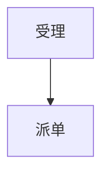

# Markdown Contract

The cleaner the Markdown, the better the Word output. Fix the source or normalized Markdown when it violates these rules.

## Headings

- Use `#`, `##`, `###`, and `####` for real headings.
- Use one top-level document title if possible.
- Do not skip from `#` to `###` unless the source intentionally omits a level.
- Do not make headings with bold paragraphs.

## Mermaid

Use fenced code blocks:

````markdown

````

Supported attributes:

- `title`: diagram caption.
- `caption`: alias of `title`.
- `style`: `auto`, `mermaid`, or `drawio` intention. The current scripts render Mermaid images; draw.io can be used manually for important diagrams.
- `wide`: `true` when a diagram should be full width.

The built-in fallback renderer supports common `flowchart` / `graph` diagrams with simple `-->` edges, node labels such as `A[文本]`, `B{判断}`, and edge labels such as `A -- 是 --> B` or `A -->|是| B`. For full Mermaid syntax, use Mermaid CLI.

## Tables

- Use Markdown tables only for comparable row/column data.
- Avoid paragraph-length cells. Convert those to prose or bullets.
- For very wide tables, split columns or mark the table for landscape handling.

## Images

- Prefer relative image paths.
- Put captions in the image title when possible:

```markdown

```

## Bid Packaging

For资信/技术 bid manuscripts, also follow `bid-layout-rules.md` when deciding whether a heading should become a page, an inline label, a summary page, or a sidecar note.

- Do not leave generated notes such as scan counts, layout instructions, or image-correction explanations in the final DOCX.
- Treat representative ID copies attached to authorization letters as part of the authorization page, not standalone chapters.
- Put contract section titles on the same page as the first contract scan.
- Use summary pages before AAA credit evidence and award-proof evidence.
- Treat Mermaid/flowchart overlap or text spilling out of boxes as a source/layout defect to fix before DOCX delivery.

## Bid Placeholders

Use explicit placeholders for missing facts:

```text
[待补充：项目经理姓名及证书编号]
```

The preflight report will collect these placeholders so they do not get lost.
